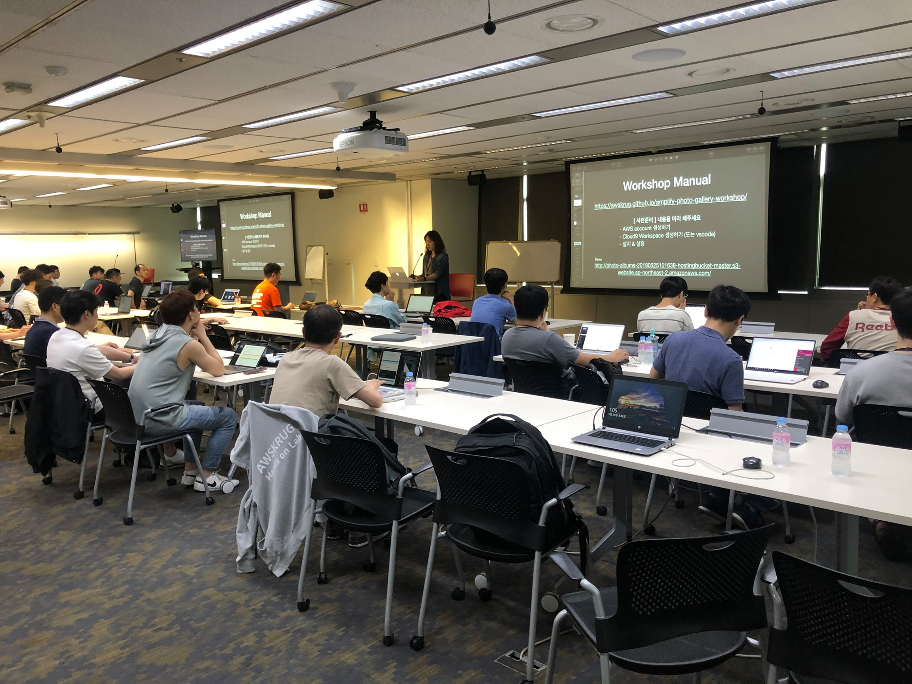

> 출처 : 페이스북 AWSKRUG- AWS한국사용자모임 (민소매를 입은 사람이 필자다.:smiley:)

이제부터 지난달 5월 25일과 29일에 열린 `Amplify` 관련 meetup에 다녀온 후기를 작성해보려 한다. 25일은 사진 앨범을 공유하는 서비스를 개발하고 배포하는 과정에 대한 발표었고 29일은 인증 및 Todo 어플리케이션을 만드는 과정을 실습하는 발표였다. 우선 난 aws에 친숙하지 않은 프론트엔드 개발자이다. 그렇기 때문에 솔직히 25일 meetup은 따라하기 바빴지만 29일은 이전 밋업을 참여한 덕분인지 그럭저럭(?) 발표 과정을 잘 따라할 수 있었다.

그래서 이번 포스팅은 29일에 발표한 내용을 바탕으로 실습하는 과정을 복습하는 차원에서 포스팅을 작성하려 한다.

## <i class="devicon-amazonwebservices-plain-wordmark colored" style="font-size: 1.3rem;"></i> Amplify란?

> AWS Amplify를 사용하면 AWS 기반의 확장 가능한 모바일 및 웹 앱을 손쉽게 생성, 구성 및 구현할 수 있습니다. Amplify는 모바일 백엔드를 원활하게 프로비저닝하고 관리하며, 백엔드를 iOS, Android, 웹 및 React Native 프런트엔드와 손쉽게 통합할 수 있는 간단한 프레임워크를 제공합니다. 또한, 프런트엔드와 백엔드 모두의 애플리케이션 릴리스 프로세스를 자동화하므로 기능을 더 빠르게 제공할 수 있습니다.

### 사전준비

아래 항목들이 준비되었다는 전제하에 포스팅을 진행하겠다.

- aws 계정 생성하기
- vscode 준비
- node
- npm or yarn

### Install amplify cli

```bash
$ npm install -g @aws-amplify/cli
```

amplify 명령어를 터미널에서 사용하기 위해 global로 설치한다.

### Amplify 환경 설정

```bash
$ amplify configure
```

`amplfiy configure` 명령어를 터미널에 입력하고 Enter를 한다.


- region: **ap-northeast-2** (서울 리전을 의미!)
- username: **test-amplify**

Enter를 한 후 다음과 같이 설정하자!

### 사용자 추가

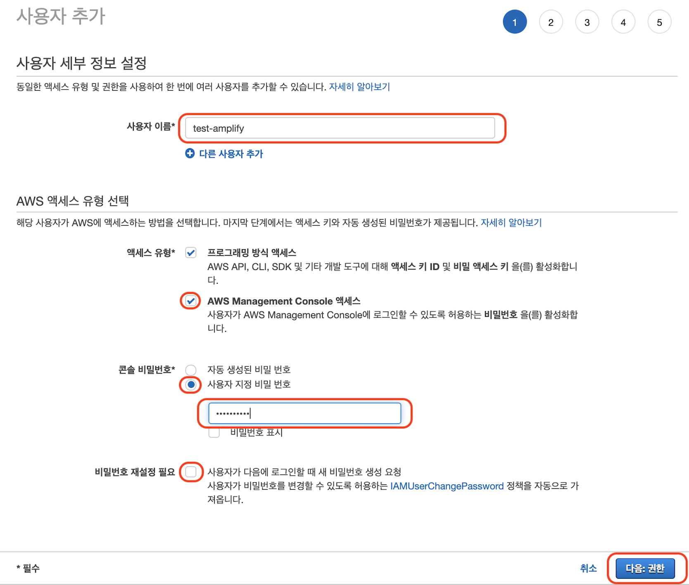

- 사용자 이름: **test-amplify**
- [x] AWS Management Console 액세스
- [x] 사용자 지정 비밀번호 설정
- [ ] 비밀번호 재설정 필요
- **다음: 권한** 버튼 클릭

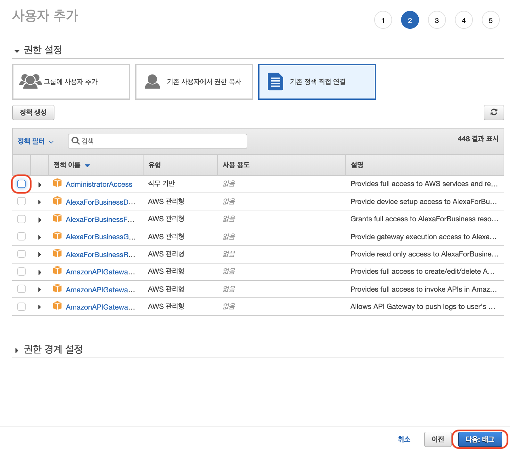

- [ ] AdministratorAccess 체크 : 권한 설정은 나중에 필요한 부분만 체크하기 위해 해제하도록 한다.
- **다음: 태그** 버튼 클릭

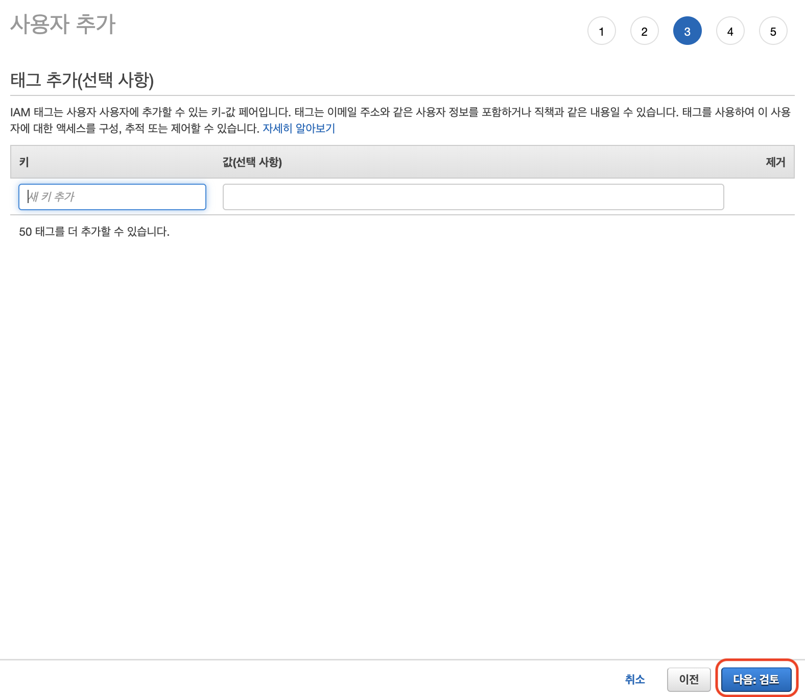

- **다음: 검토** 버튼 클릭

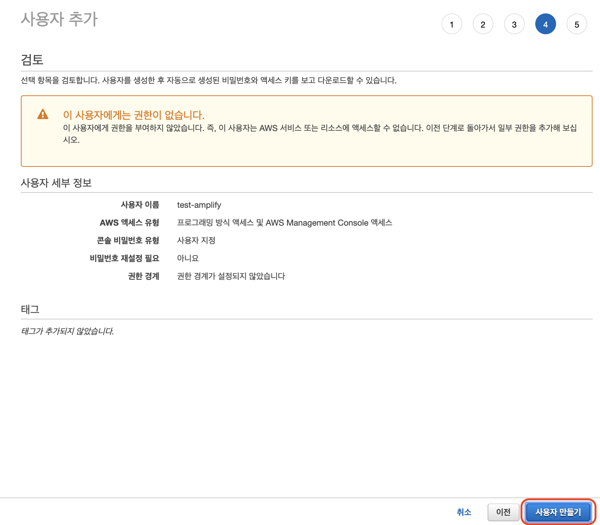

- **사용자 만들기** 버튼 클릭

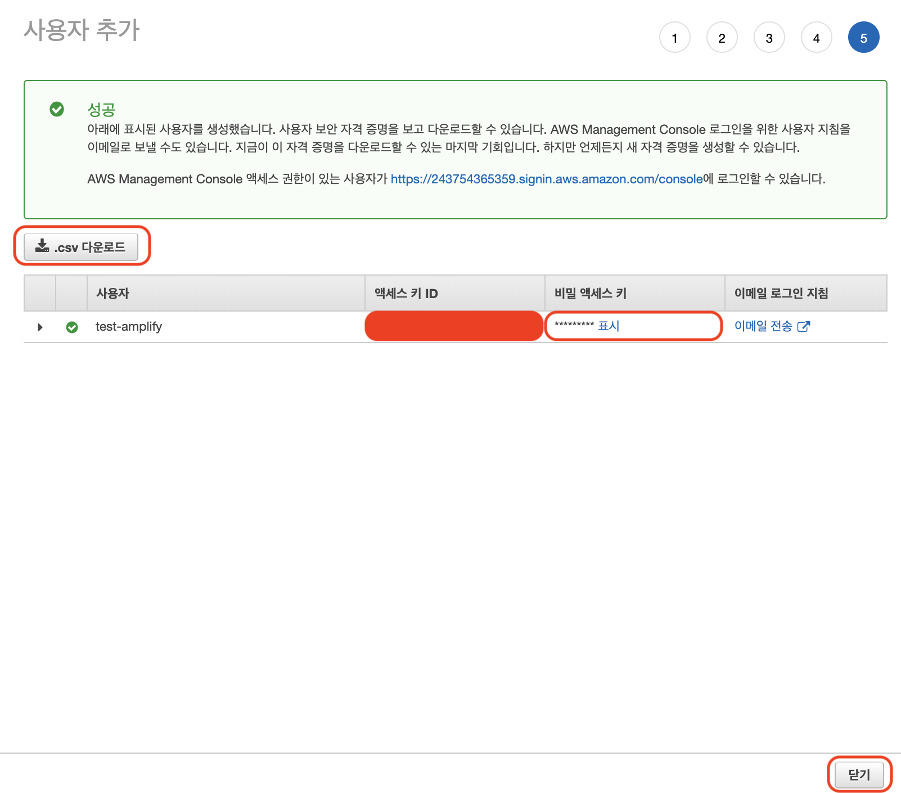

- **.CSV 다운로드** 버튼을 클릭하여 csv 파일을 잘 보관해두자.
- **닫기** 버튼을 클릭


다시 터미널로 돌아와 돌아와서 Enter를 한 후 다운로드 받은 csv 파일을 열어 `accessKeyId`와 `secretAccessKey`를 입력해준다.


다시 브라우저로 가서 AWS Management Console -> IAM 검색 -> 사용자 탭 클릭하면 다음과 같이 **test-amplify**라는 사용자가 추가되었다. :smiley:

### IAM 권한 설정

다음은 우리가 추가해야할 정책들이다.

- `API Gateway` - 시스템의 아키텍처를 내부에 숨기고 서비스로 전달되는 API 요청에 대한 응답을 적절한 형태로 응답, 즉 REST API endpoint 역할.
- `CloudFormation` - 해당 리소스의 프로비저닝과 구성을 담당한다. AWS 리소스를 개별적으로 생성하고 구성할 필요가 없다. 서버 세팅을 규격화해서 자동화 할 수 있는 서비스.
- `Cognito Identity` & `Congito User Pools` - 사용자 등록과 인증 처리.
- `DynamoDB` - NoSQL Database 서비스.
- `IAM` - AWS 리소스에 대한 액세스를 안전하게 제어할 수 있는 웹 서비스.
- `Lambda` - 서버에 대한 걱정없이 코드를 실행하고 사용한 컴퓨팅 시간에 대해서만 비용을 지불하는 서비스
- `S3` - *Simple Storage Service*의 약자로 파일 서버의 역할을 담당.


- **인라인 정책 추가** 버튼을 클릭하여 필요한 정책들을 추가해보겠다.


- 필요한 정책(CloudFormation)을 검색한 후 해당 정책(CloudFormation)을 클릭한다.

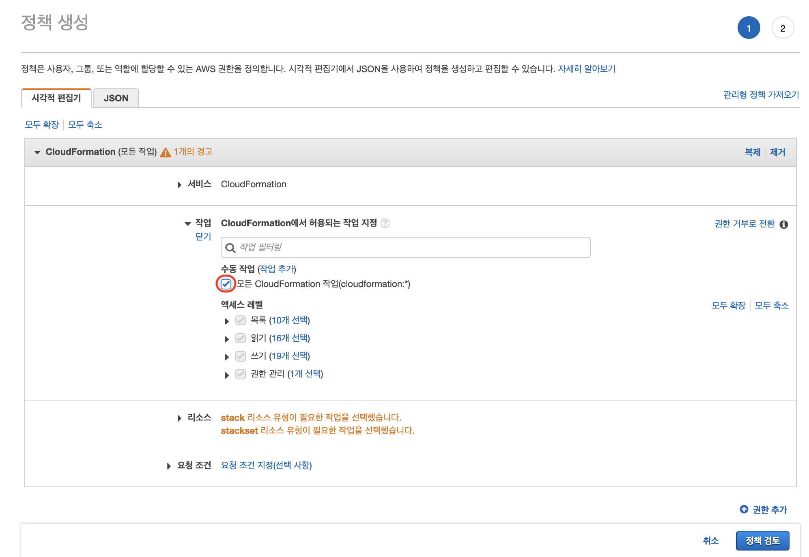

- [x] CloudFormation 작업(cloudformation:\*)

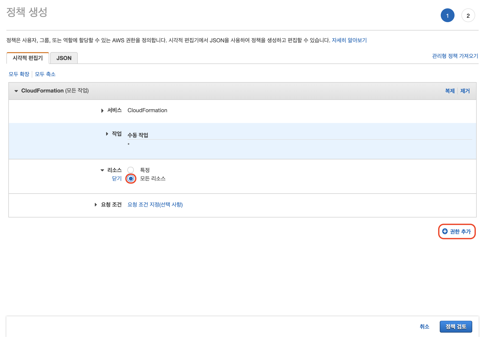

- [x] 모든 리소스
- **권한 추가** 클릭

위와 같은 순서로 8개의 권한 추가를 완료하면 **정책 검토** 버튼을 눌러 다음화면으로 넘어간다.

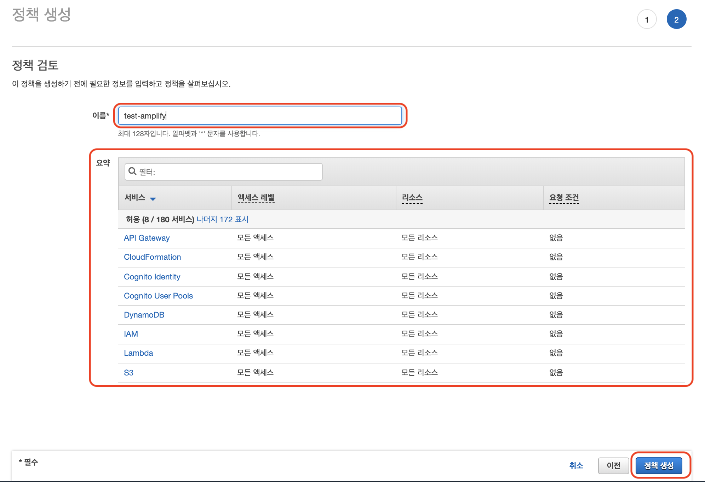

- 이름 - **test-amplify**
- 요약 - 8개의 정책들이 잘 추가되었는지 확인.
- **정책 생성** 버튼 클릭

### Create react app 설치

```bash
$ npx create-react-app amplify-app && cd amplify-app
$ yarn start
```

브라우저에 react logo가 돌아가는 화면이 보여진다면 **Ctrl + C**로 종료한다.

### Initialize Amplify

```bash
$ amplify init
```

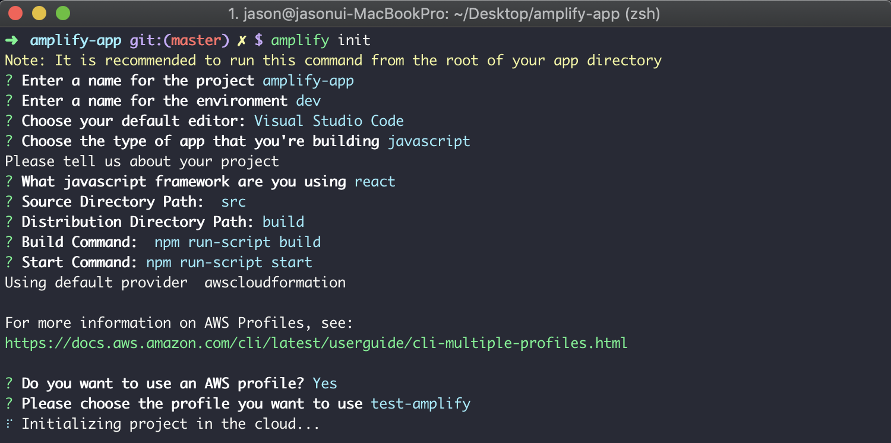

명령어를 Enter 한 후 위와 같이 작성하자.

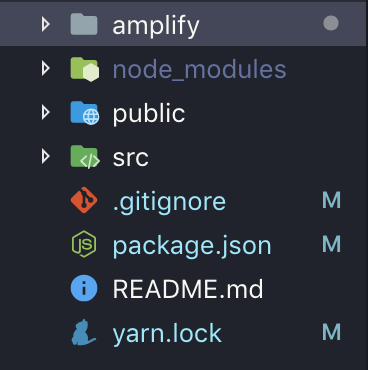

initializing을 마치면 amplify 폴더가 생성된다. 이 폴더는 즉 백엔드 역할을 수행하는 리소스들이다.

### 인증 추가하기

```bash
$ amplify auth add
```

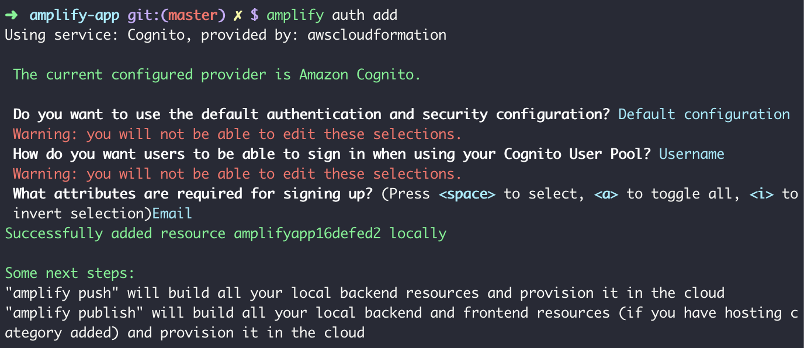

- [x] Default Configuration
- [x] Username 선택
- [x] Email 선택

```bash
$ amplify push
```

- Are you sure you want to continue? **Y**
- 클라우드에 변경사항을 반영하기 위해 실행하는 명령어이다.

### Install Amplify

```bash
$ yarn add aws-amplify aws-amplify-react
```

루트 디렉토리(amplify-app) 터미널 위치에서 react와 amplify를 연동하기 위해 2가지의 패키지를 `yarn`을 통해 install 한다.
`npm`을 사용해도 무방하다.

### React App 인증 추가하기

```js{3-5,9,15}
// App.js
import React from 'react'
import Amplify from 'aws-amplify'
import awsConfig from './aws-exports'
import { withAuthenticator } from 'aws-amplify-react'

import './App.css'

Amplify.configure(awsConfig)

function App() {
  return <div className="App">Hello World</div>
}

export default withAuthenticator(App, true)
```

- `awsConfig`는 어플리케이션에서 사용하는 클라우드 리소스의 구성 데이터를 담고 있다.
- `withAuthenticator` HOC 컴포넌트를 이용하여 `App` 컴포넌트를 감싸주고 로그인한 뒤 *USERNAME*과 _SIGN OUT_ 버튼을 보여주기 `true`로 설정해준다.

```bash
$ yarn start
```

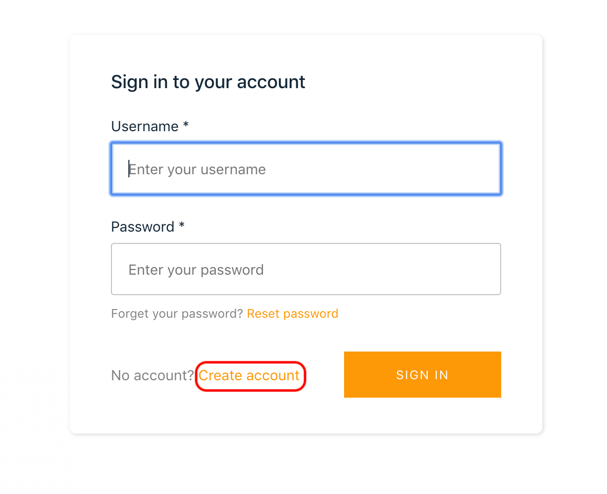

짜잔! 위와 같은 로그인 화면이 렌더링된다. 우선 계정을 만들기 위해 **Create account** 클릭한다.

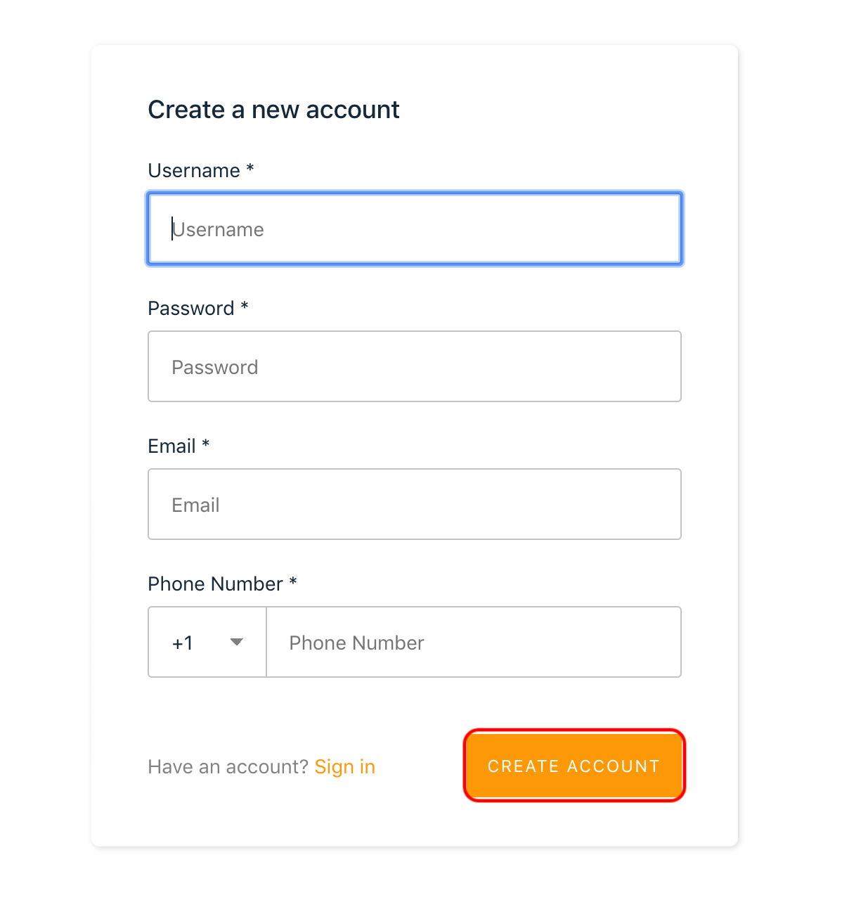

모든 필드를 작성하고 난뒤 **CREATE ACCOUNT** 버튼을 클릭한다.


이메일 확인, validation code 복사

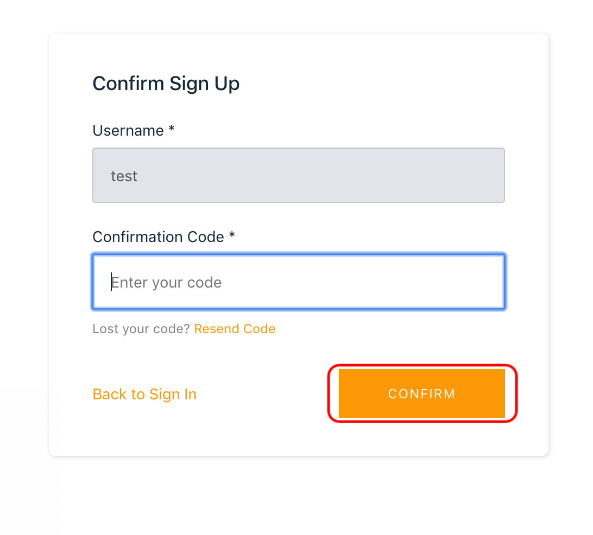

Confirmation Code에 validation code 붙여넣기 한 뒤 **CONFIRM** 버튼 클릭


마지막으로 로그인을 하면 위와 같은 화면이 렌더링된다. 인증 구현 성공!:smiley::smiley::smiley:

### Cognito 사용자 확인하기

사용자 데이터는 어디에 저장되어있는지 궁금하다. AWS Console에서 Cognito 검색 -> 사용자 풀 관리 버튼 클릭 -> 해당 사용자 풀 선택 -> 사용자 및 그룹 탭 선택

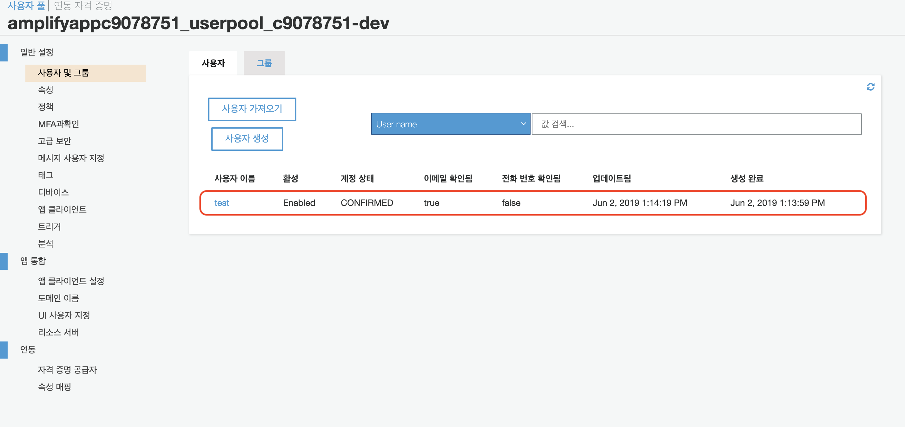

회원가입한 데이터를 확인해볼 수 있다.

### Serverless Backend Service 구축하기

```bash
$ amplify api add
```

위 명령어를 터미널에서 입력한 후 Enter를 하면 여러가지 질문에 대답을 입력해야한다.

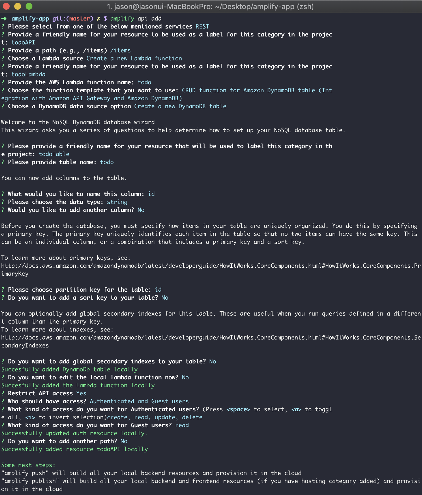

단 몇 분만에 CRUD REST API를 생성.:smiley::smiley:

```bash
$ amplify status
$ amplify push
```


위 터미널은 `amplify push` 하기 전 상황


위 터미널은 `amplify push` 한 후 상황

클라우드에 제대로 반영이 된 이후에는 로컬과 비교했을 때 변한게 없기 때문에 Opertation에 **No Change**라고 나온다. 결국 제대로 반영되었다는 이야기!! :smiley::smiley:

### Frontend에 API 연동하기

API를 연동하기 전에 프로젝트 root 폴더에서 _amplify/backend/function/todoLambda/src/app.js_ 파일을 열어 약간의 코드를 수정해야한다.

```js
//app.js
// let tableName = 'todoTable' :x:
let tableName = 'todo' // :white_check_mark:

/********************************
 * HTTP Get method for list objects *
 ********************************/
// :white_check_mark: Change get method logic
app.get(path, function(req, res) {
  const queryParams = {
    TableName: tableName,
    ProjectionExpression: 'id, title',
  }

  dynamodb.scan(queryParams, (err, data) => {
    if (err) {
      res.json({ error: 'Could not load items: ' + err })
    } else {
      res.json(data.Items)
    }
  })
})
```

백엔드 코드를 수정한 후 `amplify push` 명령어를 이용하여 클라우드에 반영한다.

자 그럼, 프론트엔드 코드인 _App.js_ 를 수정해보자.

```js{3,11,12}
// App.js
import React, { Component } from 'react'
import Amplify, { API } from 'aws-amplify'
import awsConfig from './aws-exports'
import { withAuthenticator } from 'aws-amplify-react'

import './App.css'

Amplify.configure(awsConfig)

let apiName = 'todoAPI'
let path = '/items'

class App extends Component {
  state = {
    title: '',
    content: '',
    list: [],
    showDetail: false,
    selectedItem: {},
  }

  handleChange = e => {
    const { value, name } = e.target
    this.setState({ [name]: value })
  }

  handleSubmit = async e => {
    e.preventDefault()

    const body = {
      id: Date.now().toString(),
      title: this.state.title,
      content: this.state.content,
    }

    try {
      const res = await API.post(apiName, path, { body })
      console.log(res)
    } catch (err) {
      console.log(err)
    }

    this.setState({ title: '', content: '' })
    this.fetchList()
  }

  handleSelectItem = async id => {
    this.setState({ showDetail: true, selectedItem: {} })

    try {
      const res = await API.get(apiName, `${path + '/object/' + id}`)
      this.setState({ selectedItem: { ...res } })
    } catch (err) {
      console.log(err)
    }
  }

  handleDelete = async id => {
    try {
      await API.del(apiName, `${path + '/object/' + id}`)
      this.setState({ showDetail: false })
      this.fetchList()
    } catch (err) {
      console.log(err)
    }
  }

  handleBackList = () => {
    this.setState({ showDetail: false })
  }

  async fetchList() {
    try {
      const res = await API.get(apiName, path)
      this.setState({ list: [...res] })
    } catch (err) {
      console.log(err)
    }
  }

  componentDidMount() {
    this.fetchList()
  }

  render() {
    const {
      handleChange,
      handleSubmit,
      handleSelectItem,
      handleBackList,
      handleDelete,
    } = this
    const { title, content, list, showDetail, selectedItem } = this.state

    return (
      <div className="App">
        <h2>Todo</h2>
        <form onSubmit={handleSubmit}>
          <div className="row">
            <label htmlFor="title">Title</label>
            <input
              id="title"
              type="text"
              name="title"
              value={title}
              onChange={handleChange}
            />
          </div>
          <div className="row">
            <label htmlFor="content">content</label>
            <textarea
              id="content"
              name="content"
              value={content}
              onChange={handleChange}
            />
          </div>
          <button className="btn" type="submit">
            Submit
          </button>
        </form>
        <hr />
        <h3>List</h3>
        <ul style={{ display: showDetail ? 'none' : 'block' }}>
          {list.map(item => (
            <li key={item.id} onClick={() => handleSelectItem(item.id)}>
              {item.title}
            </li>
          ))}
        </ul>
        {showDetail && (
          <div className="detail">
            <h4>{selectedItem.title}</h4>
            <p>{selectedItem.content}</p>
            <button type="button" className="btn" onClick={handleBackList}>
              Back to List
            </button>
            <button
              type="button"
              className="btn"
              onClick={() => handleDelete(selectedItem.id)}
            >
              Delete
            </button>
          </div>
        )}
      </div>
    )
  }
}

export default withAuthenticator(App, true)
```

- http 통신을 하기 위해 `aws-amplify` 에서 제공하는 `API`를 이용한다.
- `apiName`과 `path`는 api와 연동할 때 빈번하게 사용되므로 변수로 따로 할당한다.

이제 `yarn start` 명령어를 이용하여 로컬에서 테스트를 해보겠다.

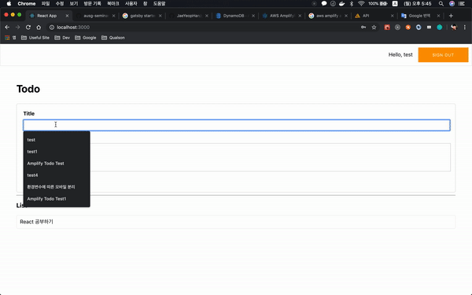

짜잔!! 드디어 완성!! :smiley::smiley::smiley:


DynamoDB에도 입력한 데이터가 잘 저장되어 있다.

### 배포

기능이 잘 작동하는것까지 확인해봤으니 S3 버킷에 배포하는 방법을 알아보겠다.

```bash
$ amplify hosting add
$ amplify publish
```

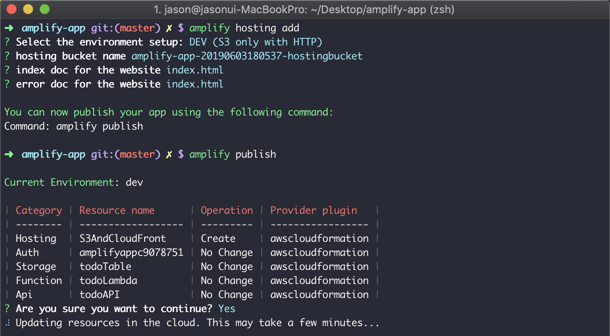

Enviroment Setup에서 **DEV** 모드를 선택하고 나머지 질문에는 Enter!

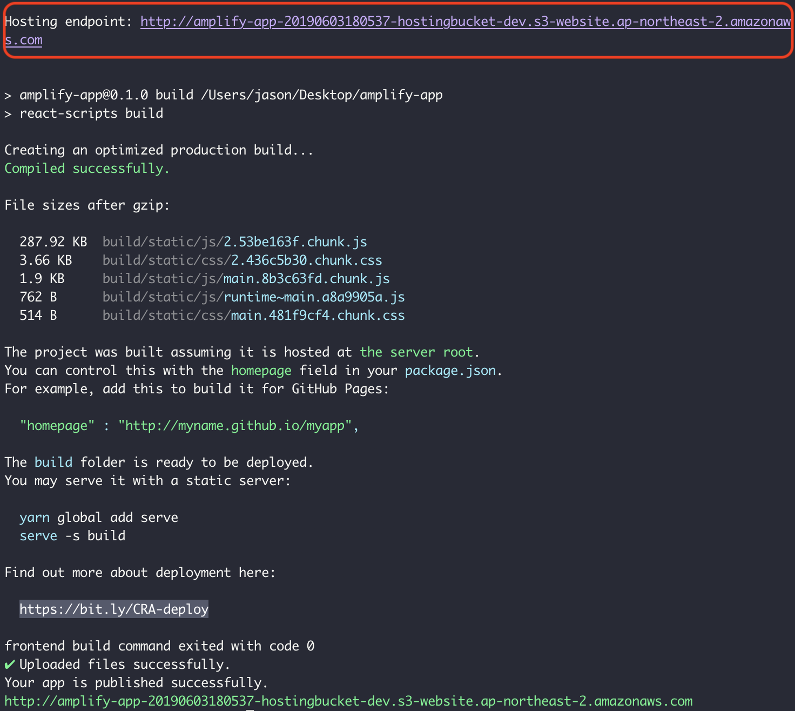

배포가 완료되면 **Hosting endpoint url** 이 보일 것이다. 드디어 끝!!!

### Wrap-up

지금까지 프론트엔드 개발자가 AWS `Amplify Framework`를 이용하여 손쉽게 어플리케이션을 제작하는 workflow를 경험해보았다. 복습을 하고 나니 AWS Service가 어떻게 유기적으로 연결되어 있는지 이해하는 계기가 되었다. 결론적으로 AWS 서비스와 친숙해지자. :smiley::smiley:

위 코드의 모든 소스는 [여기](https://github.com/jason0853/amplify-app)서 확인하길 바란다.

### Reference

- [ausg-seminar-2019](https://github.com/AUSG/ausg-seminar-2019/tree/master/WebTrack/WebTrack3)
- [Amplify Web App Workshop](https://awskrug.github.io/amplify-photo-gallery-workshop/120_deploying/10_deploying.html)
- [React와 Amplify 연동](https://aws-amplify.github.io/docs/js/react)
