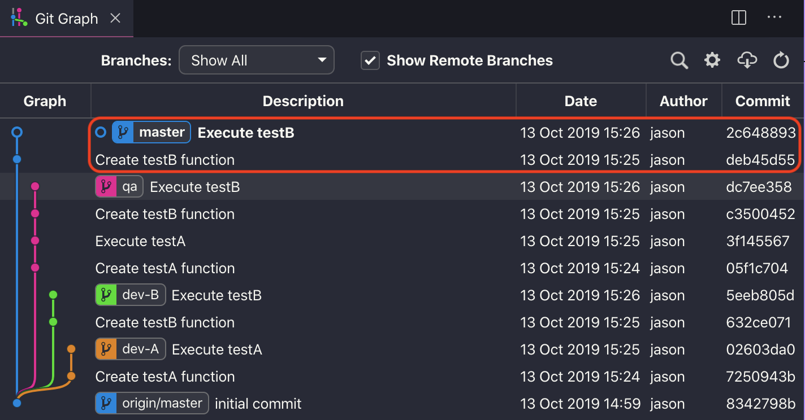

요새 바쁘다는 핑계로 블로그에 글을 못 올리고 공부도 하지 않았다. :cry::cry:
우선 각성하고 공부를 다시 시작해보겠다. 자 그럼 어떤 주제로 정리를 해볼까? :thinking::thinking::thinking: 음... 다들 프로젝트 형상관리를 할 때 git을 많이 쓸 것이다. 그 중에서 **cherry-pick**에 대해서 살펴보자.

## <i class="devicon-git-plain colored" style="font-size: 1.3rem;"></i> cherry-pick이란?

**cherry-pick**은 필요한 특정 부분을 가지고 오고 싶을 때 사용한다. 마치 :cherries::cherries::cherries: 먹고 싶은 cherry를 하나 따서 pick 하는 것이다.

### 사용하게 된 계기

회사에서 지라 협업툴을 통해 각자 업무를 할당받는다. 그리고 `master` 브랜치에서 새로운 브랜치를 만들고 checkout을 한 다음 할당 업무를 수행한다. 작업을 마치고 나서 QA서버에 push 할려는 찰나에 일부분만 merge해서 QA테스트를 해야될 것 같았다. 왜냐하면 다른 개발자 분은 API 작업을 수정해야한다고 하고 QA 쪽에서는 화면만이라도 디바이스에서 테스트해보고 싶어하셨다. 그렇다고 그냥 QA쪽 서버에 푸쉬하면 API 작업이 덜 끝났기 때문에 에러가 나서 화면 테스트를 할 수 없고 기능 구현부분을 삭제하고 원격에 배포하자니 그건 좀 아니라는 생각이 들었다.

가장 좋은 방법은 `cherry-pick`으로 해결하자!

### cherry-pick 실습

위와 같은 상황을 간단하게 만들어보자.


`dev-123`이라고 할당받은 업무를 브랜치명으로 네이밍하여 작업을 마쳤다.
빨간색 부분만 dev(QA) 브랜치에 머지해보겠다.

```bash
$ git checkout dev
$ git cherry-pick 7fa8be7^..edc1f32
```

`cherry-pick`을 할때 적용하고 싶은 시작 커밋시점의 해쉬값 끝에 `^`을 포함시켜야 시작위치부터 merge를 시작한다. 먄약 `^`을 해쉬값에 포함시키지 않으면 시작부분은 제외하고 그 다음 커밋 시점부터 merge를 시킨다.
결국 `git cherry-pick d66fd99..edc1f32`는 같은 결과를 일으킨다.
하나씩 cherry-pick을 하고 싶으면 `git cherry-pick [해당 해쉬값]`을 하면 된다. 이런 경우 커밋순서를 바꿀 수도 있다.



### cherry-pick 충돌 해결 방안

`cherry-pick`을 사용할 때 주의해야될 점이 같은 파일내에서의 병합 과정 혹은 차례대로 cherry-pick을 하지 않을 경우 코드 충돌이 일어난다.

```bash
$ git cherry-pick --abort
```

- `cherry-pick` 취소하고 싶을 경우 사용하면 된다.
  `git reset --hard`랑 비슷하다고 생각하면 된다.

```bash
$ git cherry-pick --continue
```

- 충돌을 해결하고 병합하고 싶을 경우 **Staging Area**까지 파일이 커밋 되어 있어야 사용할 수 있다.

```bash
$ git reset --hard HEAD^
```

- 성공적으로 merge를 한 이후 커밋을 취소하고 싶을때 메세지 삭제 및 병합 과정을 초기화 시킬 수 있다. 롤백이라고 생각하면 된다.

### Wrap-up

개발 프로세스에서 예상치 못한 변수가 항상 생기니 git의 또 다른 기능들도 한 번 다시 살펴봐야겠다.

### Reference

- [Cherry-pick 충돌 해결 방안](https://www.youtube.com/watch?v=xVZIP11tccY)
