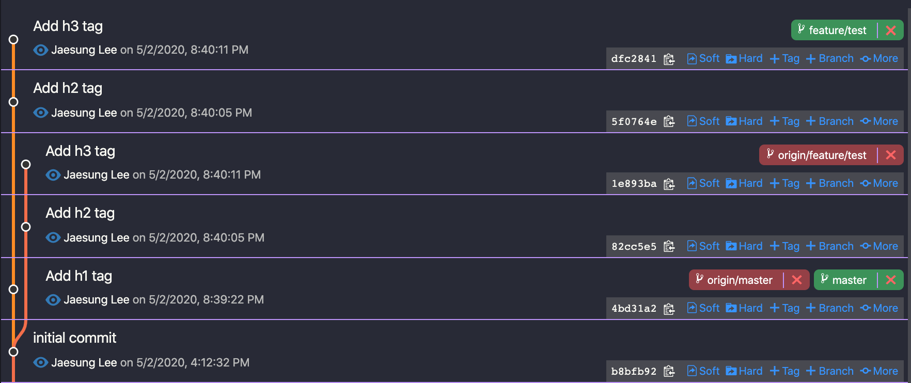
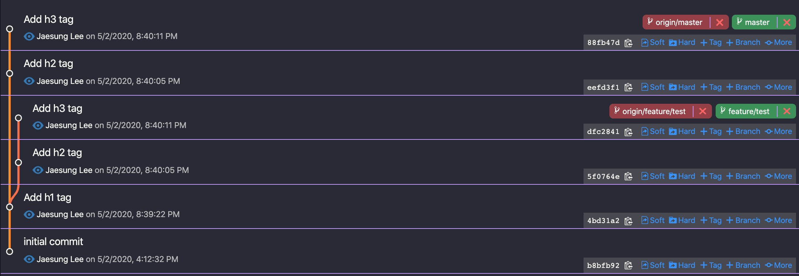
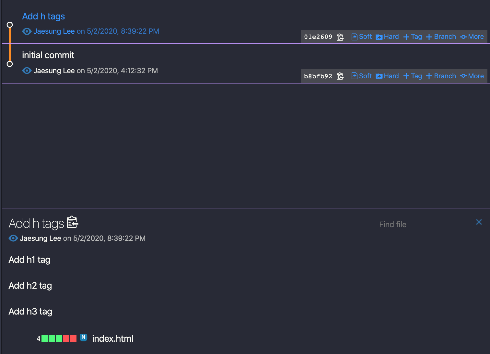

최근 **rebase**를 활용해서 병합 작업 및 commit log 수정, 합치는 작업을 진행해봤는데 공유하면 좋을 것 같아 몇 자 적어보겠다. :smiley::smiley::smiley:

## <i class="devicon-git-plain colored" style="font-size: 1.3rem;"></i> rebase 란?

> 영어 사전에 의하면 **새로운 평가 기준을 설정한다.**

커밋 로그들을 재배치하면서 커밋 라인을 깔끔하게 정리해주기 때문에 히스토리 파악이 쉬워진다.

### rebase로 병합하기


> 회사 프로젝트 bitbucket commit log 상황

지금까지 협업할 때 pull request를 요청한 이후 승인이 나면 _merge commit_ 전략으로 병합을 진행해왔다. 하지만 히스토리가 너무 복잡해지다보니 해당 커밋으로 되돌려야하는 경우가 생겼을 때 단번에 되돌리는 것도 힘들고 히스토리 파악이 제대로 되지 않는 단점이 있었다. 😢😢

그럼 해결방법은? :thinking:


> 두 브랜치 병합할 경우 conflict 나는 상황 재현

```bash
$ git rebase master
```

간단하다. 해당 `feature/branch`를 `master` 브랜치 기준으로 해서 `rebase` 병합을 진행해주면 된다.

```bash
$ git rebase --continue
```

conflict가 날 경우 해결한 뒤에 `git add`(staging area)까지 진행한 다음 위 명령어를 진행해주면 된다.

로컬 자체에서 conflict를 다 해결했기 때문에 `pull request`를 요청한 다음 승인이 나면 `rebase and merge`로 병합을 진행해주면 된다.

참고) **github**는 `rebase and merge`, **Bitbucket**은 `fast forward`라고 부른다.



> rebase로 merge를 한 상황

위에서 보듯이 origin/feature/test가 있는 것으로 보아 push를 한번 한 상황이다.
이럴 경우 push를 다시 하면 아래와 같은 에러가 일어난다.

_Updates were rejected because the tip of your current branch is behind_

현재 브랜치가 원격 브랜치보다 뒤쳐져 있기 때문이라고 하는데 이거 무시하고 강제 푸쉬를 진행한다.

```bash
$ git push origin +feature/branch
```


> 강제 푸쉬한 이후



> pr 요청 승인하고 rebase and merge 하고 난 뒤 master branch에서 pull 한 이후

`feature/branch`가 `master` 랑 잘 병합되면 작업 브랜치를 지워준다.

```bash
$ git branch -D feature/branch
$ git push origin --delete feature/branch
$ git remote prune origin
```

- `git remote prune origin` - remote에서 삭제한 브랜치를 자동으로 업데이트해준다. 로컬에서 자동으로 삭제


> 원격/로컬 feature/branch 다 지운 이후

히스토리가 깔금해진다. :smiley::smiley::smiley:

### rebase로 commit 로그 정리해보기

회사의 기존 프로젝트에서 병합을 진행할 때 `cherry-pick`을 사용하여 진행한다. 근데 문제점이 발생한다. 작업이 다 끝났고 commit log는 10개가 넘었다. 병합해야 되는 브랜치는 testing, patch, staging, master까지 차례대로 `cherry-pick`을 해야 한다. 🥵🥵🥵

이런 문제점은 어떻게 해결해야할까? :thinking:

```bash
$ git rebase -i HEAD~3
```

HEAD~ + *작업한 commit 로그 갯수*를 적어주면 아래와 같은 내용이 vim으로 나온다.

```vim
pick 4bd31a2 Add h1 tag
pick eefd3f1 Add h2 tag
pick 88fb47d Add h3 tag

# Rebase b8bfb92..88fb47d onto b8bfb92 (3 commands)
#
# Commands:
# p, pick <commit> = use commit
# r, reword <commit> = use commit, but edit the commit message
# e, edit <commit> = use commit, but stop for amending
# s, squash <commit> = use commit, but meld into previous commit
# f, fixup <commit> = like "squash", but discard this commit's log message
# x, exec <command> = run command (the rest of the line) using shell
# b, break = stop here (continue rebase later with 'git rebase --continue')
# d, drop <commit> = remove commit
# l, label <label> = label current HEAD with a name
# t, reset <label> = reset HEAD to a label
# m, merge [-C <commit> | -c <commit>] <label> [# <oneline>]
# .       create a merge commit using the original merge commit's
# .       message (or the oneline, if no original merge commit was
# .       specified). Use -c <commit> to reword the commit message.
#
# These lines can be re-ordered; they are executed from top to bottom.
#
# If you remove a line here THAT COMMIT WILL BE LOST.
#
# However, if you remove everything, the rebase will be aborted.
#
# Note that empty commits are commented out
```

자주 사용하는 것들만 정리해본다.

- `reword` : commit 메세지만 변경한다.
- `edit` : 코드 수정 및 commit 메세지 변경한다.
- `squash` : 이전 커밋과 병합한다.
- `fixup` : commit 로그만 버린다.
- `drop` : commit 자체를 지운다. (해당 라인 자체를 지워도 커밋은 제거된다.)

```vim
pick 4bd31a2 Add h1 tag
s eefd3f1 Add h2 tag
s 88fb47d Add h3 tag
```

위와 같이 수정한 다음 저장하고 새로운 커밋 메세지를 적어주면 아래와 같이 하나의 커밋으로 합쳐진다.



다시 되돌리고 싶은 경우는 아래 명령어를 참고한다.

```vim
$ git reflog
$ git reset --hard HEAD@{number}
```

### Wrap-up

지금까지 rebase를 잘 활용하지 못했었는데 이번 기회로 잘 이해하고 넘어갈 수 있었던 것 같다. 확실히 회사에 적용해야 이해도 잘 되고 보람찬 것 같다. 다음번에도 좋은 내용 있으면 공유하도록 하겠다.

### Reference

- [커밋 히스토리를 이쁘게 단장하자](https://evan-moon.github.io/2019/08/30/commit-history-merge-strategy/)
- [git squash - 여러개의 커밋로그를 하나로 묶기](https://meetup.toast.com/posts/39)
