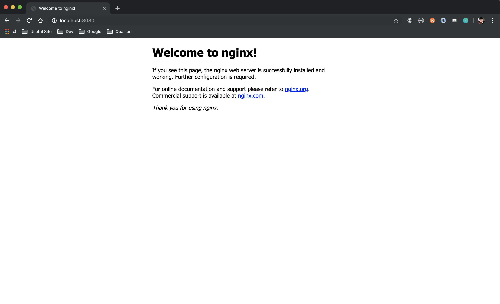
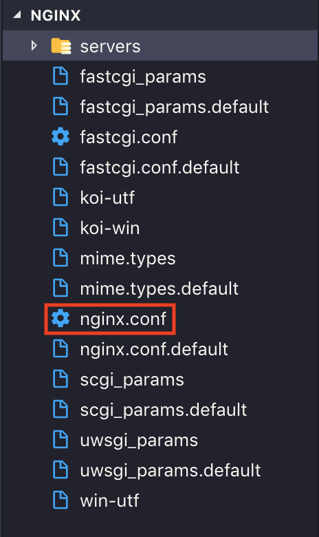
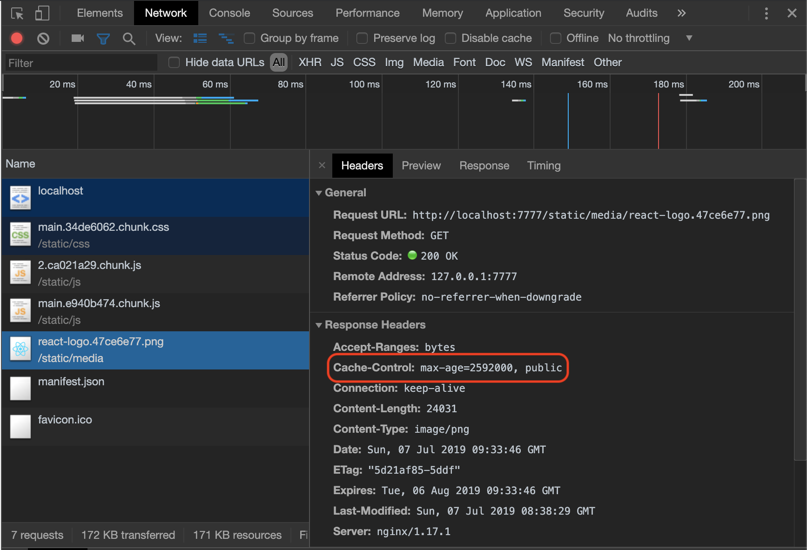
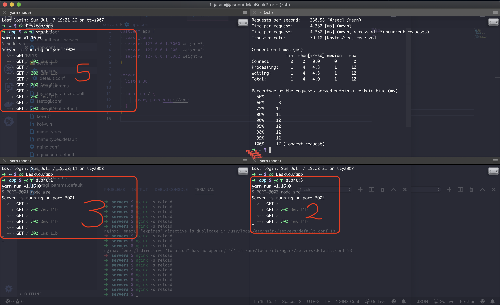
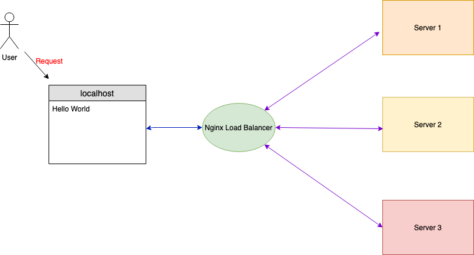

지금까지 회사에서의 업무는 DevOps Engineer가 자동화 시켜놓은 시스템 안에 프론트 관련 리소스를 저장소에 옮기는 것이 업무의 마침표였다. 하지만 난 업무 영역을 좀 더 확장시키고 싶다.
**자신이 짠 코드는 직접 서버에 배포하고 관리해야한다는게** 나의 생각이다.

## <i class="devicon-nginx-original colored" style="font-size: 1.3rem;"></i> Nginx란?

[위키백과](https://ko.wikipedia.org/wiki/Nginx)에서 **Nginx**를 다음과 같이 소개한다.

> 웹 서버 소프트웨어로, 가벼움과 높은 성능을 목표로 한다. 웹 서버, 리버스 프록시 및 메일 프록시 기능을 가진다.

**Apache**라는 유명한 웹서버가 있지만 대용량 요청을 처리하는데 있어서 웹서버로서의 한계를 드러낸다. 그리하여 등장한게 **Nginx**이다. **Nginx**는 기본적으로 Event-Driven 방식 구조를 가지고 있으며 비동기 방식으로 프로세스 내부에서 효율적으로 작업들을 처리한다.

### 설치

맥OS 기준으로 작성하겠다.

```bash
$ brew install nginx
$ nginx -v
$ nginx
$ nginx -s reload
$ nginx -s stop
```

- `Homebrew`를 통하여 `Nginx`를 설치한다.
- `nginx -v` - nginx 버전 확인
- `nginx` - 서버 시작
- `nginx -s reload` - 서버 재시작
- `nginx -s stop` - 서버 중지

서버를 시작하고 나서 [localhost:8080](http://localhost:8080/)을 접속하면 아래와 같은 화면이 나올것이다.



접속 성공!:thumbsup::thumbsup:

### 환경 설정

**Nginx**의 모든 환경 설정은 아래 경로 폴더에 있다.

```bash
$ cd /usr/local/etc/nginx && code .
```

`/usr/local/etc/nginx` 위치로 이동해서 VSCode 에서 폴더를 살펴보면 아래와 같은 파일들이 존재한다. 그 중에서도 _nginx.conf_ 파일을 살펴보자.



```nginx{3,4,6-9}
http {
    server {
        listen       8080;
        server_name  localhost;

        location / {
            root   html;
            index  index.html index.htm;
        }

        error_page   500 502 503 504  /50x.html;
        location = /50x.html {
            root   html;
        }
    }

    include servers/*;
}
```

nginx.conf 파일에서 `server` 블럭 안에 있는 몇 줄의 코드를 살펴보겠다.

- `listen 8080` - 포트 설정
- `server_name` - 서버 네임 설정
- `location` - 루트 경로 지정
  - `root` - html 폴더는 상대 경로로서 컴파일 타임에 설정된다. [참고](https://stackoverflow.com/questions/39835855/location-of-the-nginx-default-index-html-file-on-mac-os/39836193)
    html 폴더는 심볼릭 링크로 연결되어 본래 위치는 _/usr/local/var/www_ 폴더 하위에 index.html 및 50x.html 파일들이 위치해있다.
- `include` - 필요한 서버 conf 파일 경로 위치 지정

### 리액트 웹서버 띄우기

CRA를 통해 리액트 웹을 빠르게 구현하여 빌드한 소스를 nginx 서버랑 연동시켜보겠다.

```bash
$ npx create-react-app nginx-react-app && cd nginx-react-app
$ yarn add react-router-dom
```

```js
//App.js
import React from 'react'
import { BrowserRouter as Router, Route, Link } from 'react-router-dom'
import Logo from './react-logo.png'

function Index() {
  return (
    <div>
      <h2>Home</h2>
      
    </div>
  )
}

function About() {
  return <h2>About</h2>
}

function Users() {
  return <h2>Users</h2>
}

function AppRouter() {
  return (
    <Router>
      <div>
        <nav>
          <ul>
            <li>
              <Link to="/">Home</Link>
            </li>
            <li>
              <Link to="/about/">About</Link>
            </li>
            <li>
              <Link to="/users/">Users</Link>
            </li>
          </ul>
        </nav>

        <Route path="/" exact component={Index} />
        <Route path="/about/" component={About} />
        <Route path="/users/" component={Users} />
      </div>
    </Router>
  )
}

export default AppRouter
```

`react-router-dom` 패키지를 추가하여 간단한 페이지 웹을 구현해보았다. 이제 `yarn build` 명령어를 통해 `build` 폴더를 nginx에서 환경설정한다.

nginx.conf 파일에서 환경설정을 직접 수정할 수도 있겠지만 필요한 서버마다 conf 파일을 따로 만들어 include 해서 쓰는게 더 나은 방식인 것 같다. 1.10.x 이전 버전까지는 site-available 폴더에 필요한 conf 파일을 만들어 site-enabled 폴더 아래에 심볼링 링크를 생성하여 사용했었다.

```bash
$ ln -s /usr/local/etc/nginx/sites-available/default.conf /usr/local/etc/nginx/sites-enabled
```

위 명령어는 심볼링 링크 생성하는 예제이다.

```bash
$ cd /usr/local/etc/nginx/servers && touch default.conf && code .
```

servers 폴더 아래에 default.conf 파일을 다음과 같이 작성한다.

```nginx{8}
server {
    listen       7777;
    server_name  localhost;

    location / {
        root   /Users/jason/Desktop/nginx-react-app/build;
        index  index.html index.htm;
        try_files $uri /index.html;
    }
}
```

- `try_files` - react, vue, angular 라이브러리 및 프레임워크를 이용하여 개발할 경우 대부분 Single Page Application(index.html을 기반으로 내부 모듈을 교체하는 방식)으로 개발을 진행하는게 트렌드이다. 이와 같이 개발을 진행할 경우 빌드한 파일을 산출하여 웹서버에서 처리할 수 있도록 설정할 때 404 에러가 일어날 수 있다. 예를 들어 url로 [/about](http://localhost:7777/about/)이나 [/users](http://localhost:7777/users/)로 직접 접근하거나 리프레쉬 할 경우 404 에러가 발생한다. 해결책은 요청한 uri를 무시하고 index.html 파일을 제공하는 것이다.

위와 같이 작성한 뒤 nginx를 재시작하고 [localhost:7777](http://localhost:7777/)에 접속해보자.


위와 같이 나온다면 성공!! :thumbsup::thumbsup:

### 캐싱

**캐싱**은 정말 중요하다. 사용자가 이미 접속한 사이트의 리소스에 대한 변경이 없다면 브라우저에서 굳이 다시 다운로드 받지 않고 기존에 로컬에 저장되어 있는 리소스에 접근하여 훨씬 더 빠른 사이트에 접속을 할 수 있다.

기존에 작성했던 default.conf 파일에 `location` 블록 구문을 추가해보자.

```nginx{11-15}
server {
    listen       7777;
    server_name  localhost;

    location / {
        root   /Users/jason/Desktop/test/build;
        index  index.html index.htm;
        try_files $uri /index.html;
    }

    location ~* .(ico|jpg|png|gif|jpeg|swf|woff|css|js)$ {
        root /Users/jason/Desktop/test/build;
        expires 1M;
        add_header Cache-Control "public";
    }
}
```

- `expires` - 만료기한 지정 (초 - s / 일 - d / 월 - M / 년 - y), cache 끄기 `epoch` 로 설정한다.
- `add_header` - 헤더 지정.

하이라이트 된 코드 부분을 추가한 뒤 nginx 서버를 재시작해보자.

그리고 나서 개발자 도구를 열어 네트워크 탭쪽을 한번 살펴보자.



빨간 박스 부분을 보면 default.conf에서 설정한 1달 만료기한인 `max-age=2592000`(60\*60\*24\*30)과 `public`이 `Cache-Control`에 추가되어있다.

### 로드밸런싱

**로드밸런싱**이란 서버를 여러대 두어 분산 처리하는 것을 의미한다.
Nginx에는 `upstream`이라는 내장된 모듈을 제공하는데 이 모듈을 사용하여 부하 분산 및 속도 개선을 할 수 있다.

우선 Koa 프레임워크를 이용하여 간단한 어플리케이션을 작성해보겠다.

```bash
$ mkdir app && cd app
$ yarn init -y
$ yarn add koa koa-logger
$ mkdir src && cd src && touch index.js
```

```js
const Koa = require('koa')
const logger = require('koa-logger')
const app = new Koa()

const PORT = process.env.PORT || 3000

app.use(logger())

app.use(ctx => {
  ctx.body = 'Hello World'
})

app.listen(PORT, () => {
  console.log(`Server is running on port ${PORT}`)
})
```

index.js를 위와 같이 작성한다.

```json{11-15}
{
  "name": "app",
  "version": "1.0.0",
  "main": "index.js",
  "license": "MIT",
  "dependencies": {
    "koa": "^2.7.0",
    "koa-accesslog": "^0.0.2",
    "koa-logger": "^3.2.0"
  },
  "scripts": {
    "start:1": "node src",
    "start:2": "PORT=3001 node src",
    "start:3": "PORT=3002 node src"
  }
}
```

package.json 파일을 열어 하이라이트된 부분을 copy&paste 하자.

이제 로드밸런싱을 위한 conf를 작성해보자.

다시 /usr/local/etc/nginx/servers 폴더로 이동해서 app.conf 파일 하나를 생성한다. 아래와 같이 작성한다.

```nginx{1-6,12}
upstream app {
  least_conn;
  server  127.0.0.1:3000 weight=5;
  server  127.0.0.1:3001 weight=3;
  server  127.0.0.1:3002 weight=2;
}

server {
  listen 80;

  location / {
      proxy_pass http://app;
  }
}
```

- `upstream` - 여러 서버가 순차적으로 일을 할 경우 서비스를 처리하는 서버
  - `weight` - 서버 가중치 설정
  - `backup` - backup으로 설정된 이외의 서버가 동작하지 않을 경우 서비스되는 서버
- `least_conn` - 클라이언트 연결 갯수가 적은 서버로 전달하는 설정
- `proxy_pass` - 들어온 요청을 어디로 포워딩 해주는지 지정

```bash
$ yarn start:1
$ yarn start:2
$ yarn start:3
$ nginx -s reload
$ ab -n 10 http://127.0.0.1/
```

`ab`는 **Apache HTTP server benchmarking tool**로 웹서버 성능 테스트 도구로 많이 쓰이는 툴이다. `n` 옵션은 총 요청수를 의미한다.



1번 서버에는 가충치를 5, 2번 서버에는 가중치를 3, 3번 서버에는 가중치를 2로 설정했었다. 위와 같이 나온다면 로드밸런싱 성공!! :thumbsup::thumbsup:

지금해본 실습을 다이어그램으로 정리하면 아래와 같다.



### Wrap-up

이번에 Nginx를 공부하고 나니 클라이언트와 서버와의 관계에 좀 더 자세히 알게 된 것 같아 뿌듯하다.:smiley::smiley::smiley: 다음번에는 nginx에 대해 좀 더 깊게 알아보는 시간을 가져보겠다.

### Reference

- [Nginx를 사용하여 프록시 서버 만들기
  ](https://velog.io/@jeff0720/2018-11-18-2111-%EC%9E%91%EC%84%B1%EB%90%A8-iojomvsf0n)
- [Docker 로 Node.js 배포하기
  ](https://seokjun.kim/docker-nginx-node/)
- [Nginx 캐시 설정 및 캐시 만료일 기간 설정
  ](https://jootc.com/p/20180519958)
